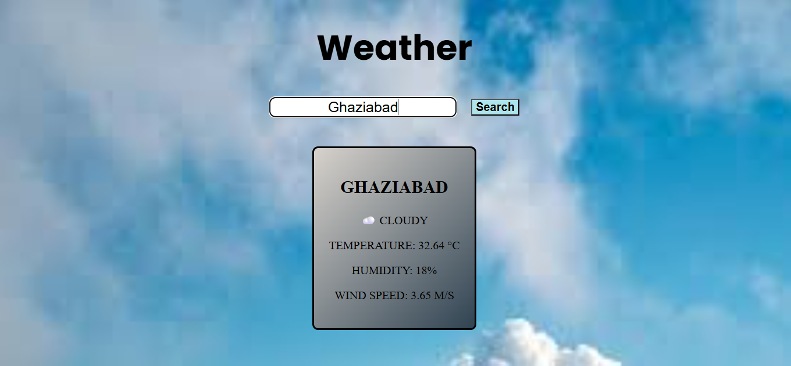

# 🌦️ Weather App

A simple weather application that allows users to search for any city and get real-time weather information using the OpenWeather API.

---

## 📸 Preview

## 📸 Preview

---

## 🚀 Features

- 🔍 Search weather by city using an input box  
- 🌡️ Displays temperature  
- ☁️ Shows weather condition (clear, cloudy, rain, etc.)  
- 💧 Displays humidity and wind speed  
- ⚡ Fast and lightweight (built with pure HTML, CSS, JavaScript)  

---

## 🛠️ Tech Stack

- HTML  
- CSS  
- JavaScript  
- OpenWeather API  

---

## 📁 Project Structure

weather-app/
│── index.html
│── style.css
│── script.js
│── README.md

---

## ⚙️ Setup Instructions

1. Clone the repository:
git clone https://github.com/Vaishnavi22Thakur/Weather-App.git

2. Open the project folder:
cd Weather-App

3. Add your API key in `script.js`:

// 🔐 Add your OpenWeather API key below
const apiKey = "YOUR_API_KEY";

4. Get your API key from OpenWeather

5. Run the project:
Open `index.html` in your browser  

---

## 🔐 API Key Note

This project uses the OpenWeather API.  
You may need to add your own API key if running locally.

---

## 🌐 Live Demo

(Add your GitHub Pages link here)

---

## 📌 Future Improvements

- 📍 Detect user location automatically  
- 📊 Add 5-day forecast  
- 🎨 Improve UI with animations  
- 🌙 Add dark/light mode  
